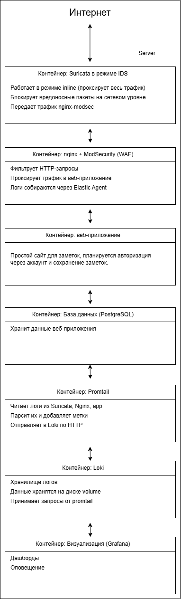

# Проект для портфолио #

>**Цель** - развернуть многоконтейнерное веб-приложение на одном физическом сервере с использованием Docker.

Весь трафик будет проходить через двухступенчатую систему защиты **WAF + Suricata**. Все события должны логироваться для мониторинга.

Архитектура проекта:

## Преимущества этой архитектуры ##

1) Разделение ответственности
    - Каждый контейнер делает одно дело.
2) Безопасность
    - База данных спрятана за внутренней сетью, доступ только по определенному порту есть только у приложения.
    - Хранение логов в volume.
3) Мониторинг
    - Всегда можно посмотреть нагрузку на сервер.
    - Получать уведомления, если, например, сайт упал.

## Структура каталогов ##

    WAF_Suricata
    - app
    - db
    - loki
    - nginx
    - promtail
    - suricata